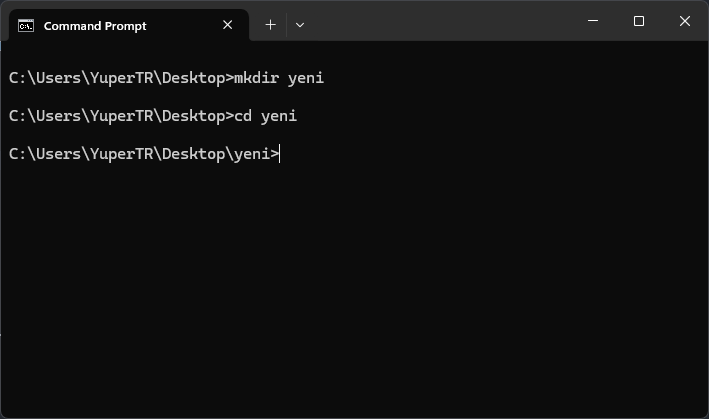

# Windows DOS Komutları
## Giriş ve Açıklama
Bu dosya, Windows işletim sistemi için kullanılan komutların açıklamalarını içerir.
## Komutlar
### dir
* Açıklama: Belirtilen dizindeki dosya ve dizinleri listeler.
* Kullanım: `dir [dizin]`
* 
### cd
* Açıklama: Belirtilen dizine geçiş yapar.
* Kullanım: `cd [dizin]`
* 
### mkdir
* Açıklama: Belirtilen dizinde yeni bir dizin oluşturur.
* Kullanım: `mkdir [dizin]`
* 
### rmdir
* Açıklama: Belirtilen dizindeki boş
dizinleri siler.
* Kullanım: `rmdir [dizin]`
* 
### copy
* Açıklama: Belirtilen dosyayı belirtilen hedefe kopyalar.
* Kullanım: `copy [dosya] [hedef]`
* 
### del
* Açıklama: Belirtilen dosyayı siler.
* Kullanım: `del [dosya]`
* 
### ren
* Açıklama: Belirtilen dosyanın adını değiştirir.
* Kullanım: `ren [eski_ad] [yeni_ad]`
* 
### cls
* Açıklama: Komut istemini temizler.
* Kullanım: `cls`
* 
### help
* Açıklama: Komutların açıklamalarını gösterir.
* Kullanım: `help`
* 
### exit
* Açıklama: Komut istemini kapatır.
* Kullanım: `exit`
* 
