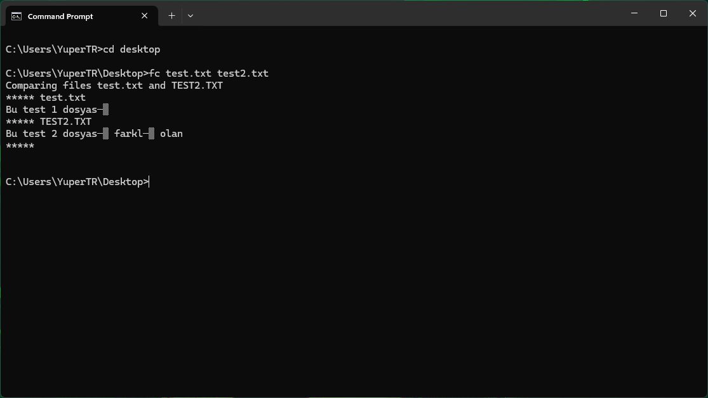

# Windows DOS Komutları
## Giriş ve Açıklama
Bu dosya, Windows işletim sistemi için kullanılan komutların açıklamalarını içerir.
## Komutlar
### dir
* Açıklama: Belirtilen dizindeki dosya ve dizinleri listeler.
* Kullanım: `dir [dizin]`
* 
### cd
* Açıklama: Belirtilen dizine geçiş yapar.
* Kullanım: `cd [dizin]`
* 
### mkdir
* Açıklama: Belirtilen dizinde yeni bir dizin oluşturur.
* Kullanım: `mkdir [dizin]`
* 
### rmdir
* Açıklama: Belirtilen dizindeki boş
dizinleri siler.
* Kullanım: `rmdir [dizin]`
* 
### copy
* Açıklama: Belirtilen dosyayı belirtilen hedefe kopyalar.
* Kullanım: `copy [dosya] [hedef]`
* 
### del
* Açıklama: Belirtilen dosyayı siler.
* Kullanım: `del [dosya]`
* 
### ren
* Açıklama: Belirtilen dosyanın adını değiştirir.
* Kullanım: `ren [eski_ad] [yeni_ad]`
* 
### cls
* Açıklama: Komut istemini temizler.
* Kullanım: `cls`
* 
### help
* Açıklama: Komutların açıklamalarını gösterir.
* Kullanım: `help`
* 
### exit
* Açıklama: Komut istemini kapatır.
* Kullanım: `exit`
* 
### type
* Açıklama: Belirtilen dosyanın içeriğini görüntüler.
* Kullanım: `type [dosya]`
* 

### move
* Açıklama: Belirtilen dosyayı veya dizini başka bir konuma taşır.
* Kullanım: `move [kaynak] [hedef]`
* 

### echo
* Açıklama: Belirtilen metni ekrana yazdırır veya dosyaya yönlendirir.
* Kullanım: `echo [metin]` veya `echo [metin] > [dosya]`
* 

### date
* Açıklama: Sistem tarihini görüntüler veya değiştirir.
* Kullanım: `date`
* 

### time
* Açıklama: Sistem saatini görüntüler veya değiştirir.
* Kullanım: `time`
* 

### ver
* Açıklama: Windows sürüm bilgisini görüntüler.
* Kullanım: `ver`
* 

### systeminfo
* Açıklama: Sistem hakkında detaylı bilgi görüntüler.
* Kullanım: `systeminfo`
* 

### tasklist
* Açıklama: Çalışan işlemleri listeler.
* Kullanım: `tasklist`
* 

### taskkill
* Açıklama: Belirtilen işlemi sonlandırır.
* Kullanım: `taskkill /PID [işlem_numarası]` veya `taskkill /IM [program_adı]`
* 

### ipconfig
* Açıklama: Ağ adaptörlerinin IP yapılandırmasını görüntüler.
* Kullanım: `ipconfig`
* 

### ping
* Açıklama: Belirtilen adrese ağ bağlantısını test eder.
* Kullanım: `ping [adres]`
* 

### netstat
* Açıklama: Ağ bağlantılarını ve portları görüntüler.
* Kullanım: `netstat`
* 

### tree
* Açıklama: Dizin yapısını ağaç görünümünde gösterir.
* Kullanım: `tree [dizin]`
* 

### attrib
* Açıklama: Dosya özelliklerini görüntüler veya değiştirir.
* Kullanım: `attrib [+/-][R|A|S|H] [dosya]`
* 

### fc
* Açıklama: İki dosyayı karşılaştırır.
* Kullanım: `fc [dosya1] [dosya2]`
* 

