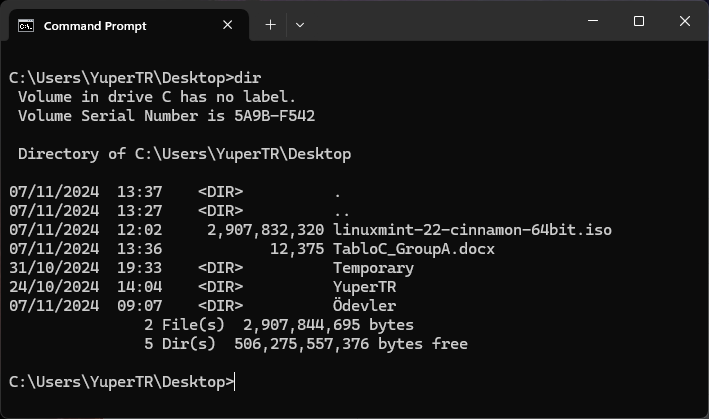

# Windows DOS Komutları
## Giriş ve Açıklama
Bu dosya, Windows işletim sistemi için kullanılan komutların açıklamalarını içerir.
## Komutlar
### dir
* Açıklama: Belirtilen konumdaki dosyaları listeler
Represents the Windows command prompt, where various DOS commands can be executed.

```DOS
dir [dizin]
```


### cd
* Açıklama: Belirtilen konuma yani dosyalara geçiş yapar.
```DOS
cd [dizin]
```


### mkdir
* Açıklama: Belirtilen konuma yeni bir dosya oluşturur. İsim vermek için sonuna vericeğiniz ismi yazmanız yeterlidir.
```DOS
mkdir [dizin]
```


### rmdir
* Açıklama: Belirtilen konumdaki dosyaları siler.
```DOS
rmdir [dizin]
```


### copy
* Açıklama: Belirtilen dosyayı belirtilen hedefe kopyalar.
```DOS
copy [dosya] [hedef]
```


### del
* Açıklama: Belirtilen dosyayı siler.
```DOS
del [dosya]
```


### ren
* Açıklama: Belirtilen dosyanın adını değiştirir.
```DOS
ren [eski_ad] [yeni_ad]
```


### cls
* Açıklama: Komut istemini temizler.
```DOS
cls
```


### help
* Açıklama: Komutların açıklamalarını gösterir.
```DOS
help
```


### exit
* Açıklama: Komut istemini kapatır.
```DOS
exit
```


### type
* Açıklama: Belirtilen dosyanın içeriğini görüntüler.
```DOS
type [dosya]
```


### move
* Açıklama: Belirtilen dosyayı veya dizini başka bir konuma taşır.
```DOS
move [kaynak] [hedef]
```


### echo
* Açıklama: Belirtilen metni ekrana yazdırır veya dosyaya yönlendirir.
```DOS
echo [metin] veya echo [metin] > [dosya]
```

* 

### date
* Açıklama: Sistem tarihini görüntüler veya değiştirir.
```DOS
date
```


### time
* Açıklama: Sistem saatini görüntüler veya değiştirir.
```DOS
time
```


### ver
* Açıklama: Windows sürüm bilgisini görüntüler.
```DOS
ver
```


### systeminfo
* Açıklama: Sistem hakkında detaylı bilgi görüntüler.
```DOS
systeminfo
```


### tasklist
* Açıklama: Çalışan işlemleri listeler.
```DOS
tasklist
```
 


### taskkill
* Açıklama: Belirtilen işlemi sonlandırır.
```DOS
taskkill /PID [işlem_numarası] veya taskkill /IM [program_adı]
```


### ipconfig
* Açıklama: Ağ adaptörlerinin IP yapılandırmasını görüntüler.
```DOS
ipconfig
```
 


### ping
* Açıklama: Belirtilen adrese ağ bağlantısını test eder.
```DOS
ping [adres]
```
* 

### netstat
* Açıklama: Ağ bağlantılarını ve portları görüntüler.
```DOS
netstat
```


### tree
* Açıklama: Dizin yapısını ağaç görünümünde gösterir.
```DOS
tree [dizin]
```
* 

### attrib
* Açıklama: Dosya özelliklerini görüntüler veya değiştirir.
```DOS
attrib [+/-] [``R|A|S|H] [dosya]
```


### fc
* Açıklama: İki dosyayı karşılaştırır.
```DOS
fc [dosya1] [dosya2]
```


